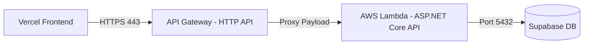

# AWS Lambda Serverless Deployment & Hosting Manual

This document is the master operational guide for hosting the **Student Financial Management Web API** on a cost-optimized, secure, and auto-scaling AWS serverless architecture. It explains the mechanics, steps, security models, and rationale behind each resource.

---

## 🏛️ 1. Architecture Overview (What & Why)

Rather than running a traditional virtual server (like EC2) which bills you 24/7 even when idle, this application uses a fully serverless architecture.



### Component Breakdown:
*   **Vercel (Frontend)**: Native Next.js hosting. Direct Git-trigger deployments.
*   **Amazon API Gateway (HTTP API)**: The front door. Receives public requests, maps routing, terminates HTTPS, and invokes the Lambda function.
*   **AWS Lambda (Backend)**: Event-driven execution. Spins up microVMs on demand to process API controllers, then freezes them when complete.
*   **Supabase (Database)**: Cloud-hosted PostgreSQL. Managed outside AWS to leverage its free tier and connection pooling tools (Supavisor).

---

## 🔐 2. Identity & Security Strategy (How & Why)

We adhere strictly to the **Principle of Least Privilege** and separate dev credentials from production roles.

### A. Local developer IAM User (`st-finance-dev`)
*   **What it is**: A dedicated user account in your AWS IAM registry.
*   **Why**: Separates this project's security boundary from your Root account and other future projects. If credentials are leaked, only this user's scope is affected.
*   **How it works**: Local CLI commands sign requests using Access Keys linked to this user's policies.

### B. GitHub Actions OIDC Deployer (`github-actions-lambda-deployer`)
*   **What it is**: An IAM Role that permits GitHub Actions runners to authenticate without storing permanent passwords/keys in GitHub Secrets.
*   **Why**: Traditional access keys in GitHub Secrets can be stolen if the repository is compromised. **OpenID Connect (OIDC)** uses temporary, short-lived security tokens.
*   **How it works**: AWS trusts GitHub's authentication authority. GitHub Actions presents a JWT to AWS, and AWS STS returns temporary credentials that expire automatically after the build.

### C. Lambda Execution Role (`st-finance-lambda-execution-role`)
*   **What it is**: An IAM role assumed by the Lambda function itself when it runs your code.
*   **Why**: Lambda needs explicit permission to perform system-level tasks (like writing logs to CloudWatch).
*   **How it works**: Locked down with only the `AWSLambdaBasicExecutionRole` policy. The deployer role uses `iam:PassRole` to assign this execution role to the Lambda function.

---

## 📦 3. S3 Deployment Staging Bucket (What & Why)

During deployment, we package our API into a ZIP file. Because AWS CloudFormation cannot build directly from your local computer, we use a private S3 staging bucket: **`st-finance-deployments-ryan-2026`**.

### Security & Cost Controls:
*   **Block Public Access**: (What & Why) All public reads/writes are blocked. Only CloudFormation and your authenticated CLI have permission to read this bucket, keeping your compiled C# code secure.
*   **7-Day Lifecycle Expiration**: (What & Why) S3 charges for storage capacity. Since these ZIP packages are only needed during the deployment process, we configure a Lifecycle Rule that **automatically deletes files after 7 days**, ensuring your staging costs remain exactly **$0.00**.

---

## 🛠️ 4. Code & Configuration Setup (How)

The .NET 8 Web API is configured to run seamlessly both locally (via Kestrel) and in the cloud (via Lambda).

### A. Project References (`ST_finance.Api.csproj`)
We use the official AWS hosting wrapper package:
```xml
<PackageReference Include="Amazon.Lambda.AspNetCoreServer.Hosting" Version="2.1.0" />
```

### B. Bootstrap Wrapper (`Program.cs`)
The API detects if it is running in AWS Lambda and acts accordingly:
```csharp
builder.Services.AddAWSLambdaHosting(LambdaEventSource.HttpApi);
```

### C. Git-Safe Configuration (`appsettings.json` vs. Environment Variables)
*   **Local development**: Dev secrets are stored in `appsettings.Development.json` (ignored by Git).
*   **Production/Staging**: `appsettings.json` contains no secrets. Connection strings and signing keys are injected securely at runtime via **Lambda Environment Variables**:
    *   `ASPNETCORE_ENVIRONMENT` = `Staging`
    *   `ConnectionStrings__DbConnection` = `[Supabase connection string]`
    *   `JwtSettings__SecretKey` = `[JWT secret key]`

---

## 🚀 5. Command-Line Deployment Manual (How)

Use these commands to build, upload, and deploy your serverless stack:

### A. Prerequisite: Create the S3 Bucket (Already Done)
To create the bucket, block public access, and attach the 7-day lifecycle rule:
```bash
# Create the bucket in Singapore
aws s3api create-bucket --bucket st-finance-deployments-ryan-2026 --region ap-southeast-1 --create-bucket-configuration LocationConstraint=ap-southeast-1

# Block public access
aws s3api put-public-access-block --bucket st-finance-deployments-ryan-2026 --public-access-block-configuration "BlockPublicAcls=true,IgnorePublicAcls=true,BlockPublicPolicy=true,RestrictPublicBuckets=true"

# Apply the 7-day deletion rule
aws s3api put-bucket-lifecycle-configuration --bucket st-finance-deployments-ryan-2026 --lifecycle-configuration '{"Rules":[{"ID":"DeleteOldDeployments","Status":"Enabled","Filter":{"Prefix":""},"Expiration":{"Days":7}}]}'
```

### B. Deploy the Serverless Stack
Run this command from the `ST_finance.Api/` directory to deploy:
```bash
cd ST_finance.Api
dotnet lambda deploy-serverless --s3-bucket st-finance-deployments-ryan-2026
```
*(This uses the `serverless.template` to package the code, upload it to `st-finance-deployments-ryan-2026`, and spin up the Lambda function and API Gateway.)*

---

*Related links:*
- [[Environments]]
- [[Architecture-Design]]
