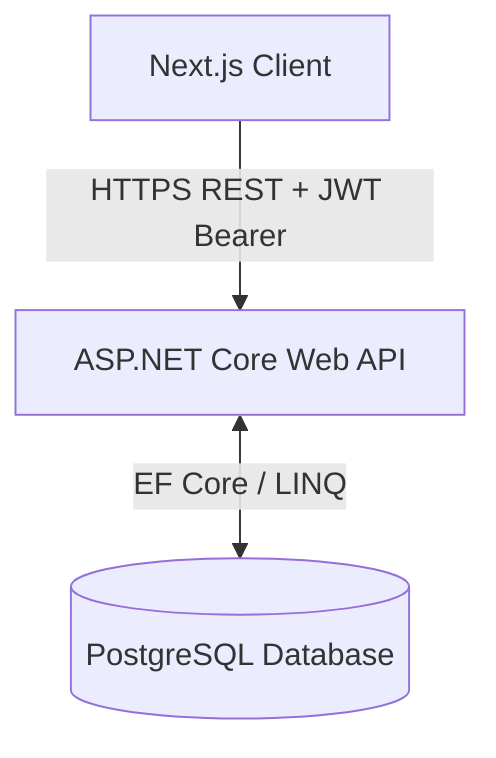
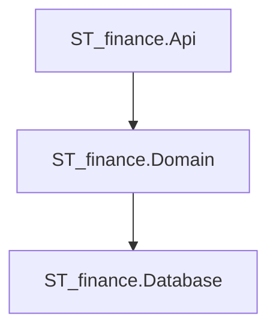

# Architecture Design

This document details the high-level system design and software architecture of the Student Financial Management Application.

## 🏛️ System Overview

The system uses a decoupled Client-Server architecture (see [[Environments]] for detailed configuration of staging and production environments):
1.  **Frontend (Next.js)**: A single-page application (SPA) built with React and Next.js, styled using Tailwind CSS and components from Shadcn UI. Hosted on Vercel.
2.  **Backend (ASP.NET Core Web API)**: A RESTful API built on .NET 8.0 using Clean Architecture. Hosted on AWS Lambda (Serverless via API Gateway HTTP API) for staging.
3.  **Database (PostgreSQL)**: A relational database storing users, profiles, accounts, transactions, recurring rules, budgets, and savings tracking. Hosted on Supabase for staging.



---

## 🎛️ Backend Architecture: 3-Tier Layered Architecture

To support direct communication between the Domain and Database layers, the backend is partitioned into 3 distinct projects within the `ST_finance.slnx` solution:



### 1. API (`ST_finance.Api`)
*   **Role**: The hosting bootstrap and startup project. Sets up HTTP middleware pipelines (CORS, JWT auth, Swagger UI, Global Error handlers), manages dependency injection graph composition, and hosts the API entry point.
*   **Dependencies**: References `ST_finance.Domain`.
*   **Note**: No controllers are registered directly in the API layer. They are discovered dynamically from the Domain project assembly via application parts.

### 2. Domain (`ST_finance.Domain`)
*   **Role**: Contains the business logic services, validators, and all REST Controllers. It directly communicates with the Database layer to query/persist entities.
*   **Dependencies**: References `ST_finance.Database` and `ST_finance.Shared`.
*   **Key Contents**:
    *   API Controllers: Inherit from `ApiControllerBase` and live in their respective feature folders (e.g. `ST_finance.Domain/Features/Accounts/AccountsController.cs`).
    *   Business services: `AuthService`, `AccountService`, `TransactionService`.
    *   Business validation models.

### 3. Database (`ST_finance.Database`)
*   **Role**: Manages data persistence, mapping, entities, database contexts, and migration schemas.
*   **Dependencies**: References `ST_finance.Shared` (for enums).
*   **Key Contents**:
    *   EF Core context: `AppDbContext` configuring Identity databases and global query filters.
    *   PostgreSQL entities mapped to `Tbl_` prefixed tables.

---

## 🎨 Core Architectural Decisions

### 1. Result Pattern Response Wrapping
Every API action returns a wrapped response body in the `Result` or `Result<TValue>` pattern. All business validations return `Result.Failure(...)` instead of throwing exceptions. The JSON structure returned to the client is always uniform:
```json
{
  "isSuccess": true,
  "isFailure": false,
  "error": { "code": "", "message": "" },
  "value": { ... }
}
```

### 2. Dual-Layer Validation Check
*   **Controller Layer**: Validates request parameter formats using `ModelState.IsValid` and returns `Result.Failure<T>` directly.
*   **Service Layer**: Validates business logic rules (uniqueness, status constraints) and bubbles up typed `Result.Failure` records.

### 3. System-Wide Soft Deletes
*   All user tables include a `delete_flag` column (type `BOOLEAN NOT NULL DEFAULT FALSE`).
*   Entities are marked as `DeleteFlag = true` instead of calling hard deletes.
*   `AppDbContext` registers EF Core **Global Query Filters** for all models to automatically exclude soft-deleted records from standard database LINQ lookups.

### 4. Strongly Typed Enum Mappings
*   Enum structures (like `AccountType`) are defined in C# and mapped in EF Core using `.HasConversion<string>()` to persist as text/varchar values in PostgreSQL, satisfying database-level `CHECK` constraints while retaining type-safety in C#.

---

## 🔒 Authentication Flow
*   **Protocol**: JSON Web Token (JWT) Bearer Authentication.
*   **Flow**:
    1.  User posts credentials to `/api/auth/login`.
    2.  `Api` processes credentials using ASP.NET Core Identity.
    3.  On success, the backend generates a JWT containing user claims (e.g., UserId, Email) signed with a private security key.
    4.  The client receives the token and stores it in secure cookie/local storage.
    5.  For all subsequent API calls, the client includes the token in the `Authorization: Bearer <JWT>` HTTP header.
    6.  The backend verifies the signature and scope before responding.

---
**Next Step**: Read about the database tables and columns in [[Database-Schema]].
