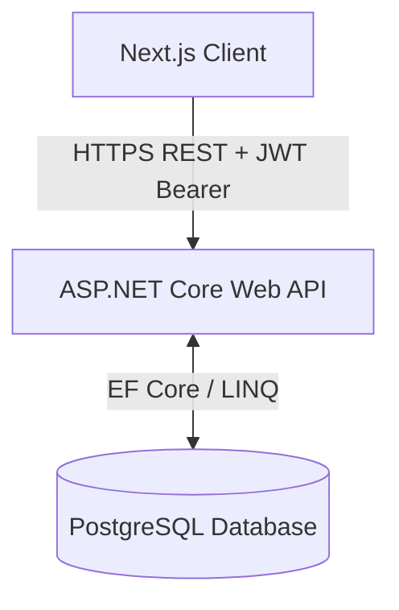
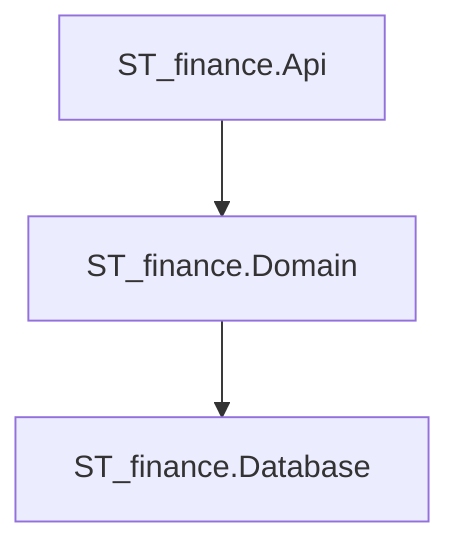

# Architecture Design

This document details the high-level system design and software architecture of the Student Financial Management Application.

## 🏛️ System Overview

The system uses a decoupled Client-Server architecture:
1.  **Frontend (Next.js)**: A single-page application (SPA) built with React and Next.js, styled using Tailwind CSS and components from Shadcn UI. Deployed on Vercel.
2.  **Backend (ASP.NET Core Web API)**: A RESTful API built on .NET 8.0 using Clean Architecture. Deployed on a container-compatible platform.
3.  **Database (PostgreSQL)**: A relational database storing users, profiles, accounts, transactions, recurring rules, budgets, and savings tracking.

---

## 🎛️ Backend Architecture: 3-Tier Layered Architecture

To support direct communication between the Domain and Database layers, the backend is partitioned into 3 distinct projects within the `ST_finance.slnx` solution:

### 1. API (`ST_finance.Api`)
*   **Role**: The entry point of the application. Handles HTTP requests, controllers, routing, middleware (CORS, JWT auth, global errors), Swagger documentation, and composition of dependency injection.
*   **Dependencies**: References `ST_finance.Domain`.
*   **Key Contents**:
    *   Controllers: `AuthController`, `AccountController`, `ExpenseController`, `DashboardController`.
    *   Auth pipeline and JWT authentication setup.

### 2. Domain (`ST_finance.Domain`)
*   **Role**: Contains the business logic, services, rules, and validators. It directly communicates with the database layer to execute queries and manage operations.
*   **Dependencies**: References `ST_finance.Database`.
*   **Key Contents**:
    *   Business services: `QuotaCalculator`, `AllowanceManager`, `GoalService`.
    *   Business validation rules.
    *   MediatR requests/handlers (CQRS flow if used, or standard services).

### 3. Database (`ST_finance.Database`)
*   **Role**: Manages data persistence, mapping, tables, and database migrations.
*   **Dependencies**: References nothing.
*   **Key Contents**:
    *   Entity Framework Core database context (`ApplicationDbContext`).
    *   Database entities mapped to `Tbl_` tables: `Tbl_User`, `Tbl_UserProfile`, `Tbl_Account`, `Tbl_Category`, `Tbl_Tag`, `Tbl_Transaction`, `Tbl_RecurringSchedule`, `Tbl_CategoryBudget`, `Tbl_DailyQuotaLog`, `Tbl_SavingsGoal`, `Tbl_SavingsContribution`.
    *   EF Core migrations.
    *   Global Exception Handler middleware.

---

## 🔒 Authentication Flow
*   **Protocol**: JSON Web Token (JWT) Bearer Authentication.
*   **Flow**:
    1.  User posts credentials to `/api/auth/login`.
    2.  `Api` processes credentials using ASP.NET Core Identity.
    3.  On success, the backend generates a JWT containing user claims (e.g., UserId, Email) signed with a private security key.
    4.  The client receives the token and stores it in secure cookie/local storage.
    5.  For all subsequent API calls, the client includes the token in the `Authorization: Bearer <JWT>` HTTP header.
    6.  The backend verifies the signature and scope before responding.

---
**Next Step**: Read about the database tables and columns in [[Database-Schema]].
