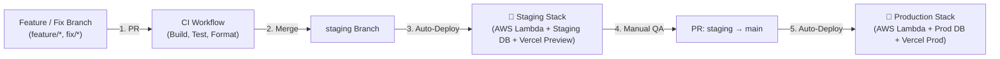

# Environments & Deployment Guide

This document tracks the active hosting environments, infrastructure strategy, and branching workflow for the Student Financial Management Application.

---

## 📌 Branching & Development Workflow (Write → Test → Deploy)

1. **Feature / Fix Development**: Branch off `staging`. Run `dotnet test` and formatting checks locally.
2. **Pull Request**: Open PR targeting `staging`. GitHub Actions CI (`ci.yml`) validates compilation, unit tests, and code style.
3. **Staging Verification**: Merging to `staging` automatically deploys backend to AWS Lambda (`st-finance-staging-stack`) and frontend to Vercel Preview. Verify features against the Staging database.
4. **Production Release**: Open PR from `staging` to `main`. Merging deploys backend to AWS Lambda (`st-finance-prod-stack`) and frontend to Vercel Production.

---

## 🧪 Staging Environment

| Component | Technology | Target / Resource Name | Details |
| :--- | :--- | :--- | :--- |
| **Database** | PostgreSQL | Supabase (Staging Project) | Isolated PostgreSQL instance. Completely separate from production data. |
| **Backend API** | ASP.NET Core 8.0 | AWS Lambda (`st-finance-staging-stack`) | Deployed via CloudFormation stack. |
| **S3 Deploy Bucket** | AWS S3 | Staging S3 Bucket | Stores staging build ZIPs and templates. |
| **Frontend UI** | Next.js | Vercel Preview | Connected to Staging API Gateway URL. |
| **API Docs (Scalar)** | Scalar / OpenAPI | Disabled | Scalar/Swagger disabled in Staging & Production (`IsDevelopment()` only). |

---

## 🚀 Production Environment

| Component | Technology | Target / Resource Name | Details |
| :--- | :--- | :--- | :--- |
| **Database** | PostgreSQL | Supabase (Production Project) | Managed PostgreSQL instance hosting live user data. |
| **Backend API** | ASP.NET Core 8.0 | AWS Lambda (`st-finance-prod-stack`) | Deployed via CloudFormation stack. |
| **S3 Deploy Bucket** | AWS S3 | Production S3 Bucket | Stores production build ZIPs and templates. |
| **Frontend UI** | Next.js | Vercel Production | Connected to Production API Gateway URL. |
| **API Docs (Scalar)** | Scalar / OpenAPI | Disabled | Scalar/Swagger disabled in Staging & Production (`IsDevelopment()` only). |

---

## 🛠️ GitHub Environment Secrets

All deployment credentials and stack variables are scoped per environment in **GitHub Settings → Environments**:

* **`staging` Environment Secrets**:
  - `AWS_ROLE_TO_ASSUME`: Staging IAM Deployer Role ARN
  - `AWS_DEPLOYMENT_S3_BUCKET`: Staging S3 Bucket Name

* **`Production` Environment Secrets**:
  - `AWS_ROLE_TO_ASSUME`: Production IAM Deployer Role ARN
  - `AWS_DEPLOYMENT_S3_BUCKET`: Production S3 Bucket Name

---

*Related Documentation:*
- [AGENTS.md](file:///Users/ryanmyatthu/Desktop/FinancialManagement/.agents/AGENTS.md) — Coding Standards & AI Agent Guidelines
- [AWS Lambda Deployment Guide](file:///Users/ryanmyatthu/Desktop/FinancialManagement/docs/AWS-Lambda-Deployment-Guide.md) — AWS Architecture Overview
